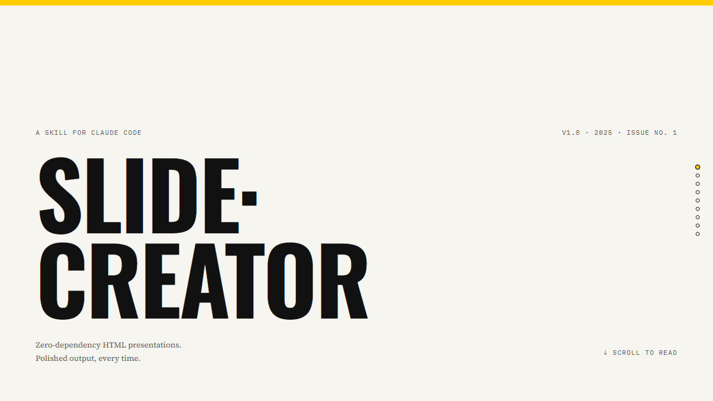
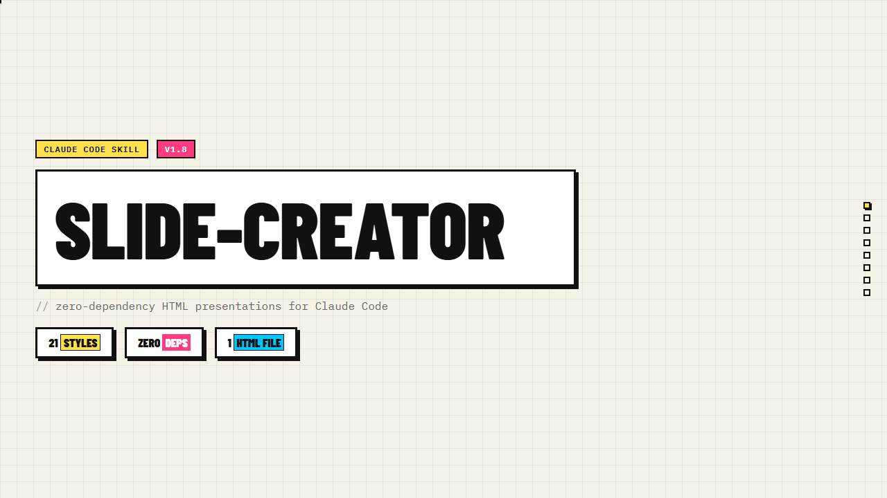

# slide-creator

> You have great content — but great content deserves a great presentation. AI can generate slides, but the results are inconsistent and re-rolling gets old fast. Slide-Creator gives you stable, polished output every time: pick a style that fits your audience, and let the model handle the rest. Go grab a coffee.
>
> **[See the guide as a report →](https://kaisersong.github.io/slide-creator/demos/blue-sky-en.html)** — this document was generated by slide-creator itself.

A skill for [Claude Code](https://claude.ai/claude-code) and [OpenClaw](https://openclaw.ai) that generates stunning, zero-dependency HTML presentations.

English | [简体中文](README.zh-CN.md)

---

## Live Demo

See what slide-creator produces — open directly in your browser:

- [slide-creator intro (English)](https://kaisersong.github.io/slide-creator/demos/blue-sky-en.html)
- [slide-creator 介绍（中文）](https://kaisersong.github.io/slide-creator/demos/blue-sky-zh.html)

Click any screenshot below to open the live demo (same content, different styles):

<table>
<tr>
<td align="center"><a href="https://kaisersong.github.io/slide-creator/demos/blue-sky-en.html"></a><br/><b>Blue Sky</b></td>
<td align="center"><a href="https://kaisersong.github.io/slide-creator/demos/bold-signal-en.html"></a><br/><b>Bold Signal</b></td>
<td align="center"><a href="https://kaisersong.github.io/slide-creator/demos/electric-studio-en.html"></a><br/><b>Electric Studio</b></td>
</tr>
<tr>
<td align="center"><a href="https://kaisersong.github.io/slide-creator/demos/creative-voltage-en.html"></a><br/><b>Creative Voltage</b></td>
<td align="center"><a href="https://kaisersong.github.io/slide-creator/demos/dark-botanical-en.html"></a><br/><b>Dark Botanical</b></td>
<td align="center"><a href="https://kaisersong.github.io/slide-creator/demos/notebook-tabs-en.html"></a><br/><b>Notebook Tabs</b></td>
</tr>
<tr>
<td align="center"><a href="https://kaisersong.github.io/slide-creator/demos/pastel-geometry-en.html"></a><br/><b>Pastel Geometry</b></td>
<td align="center"><a href="https://kaisersong.github.io/slide-creator/demos/split-pastel-en.html"></a><br/><b>Split Pastel</b></td>
<td align="center"><a href="https://kaisersong.github.io/slide-creator/demos/vintage-editorial-en.html"></a><br/><b>Vintage Editorial</b></td>
</tr>
<tr>
<td align="center"><a href="https://kaisersong.github.io/slide-creator/demos/neon-cyber-en.html"></a><br/><b>Neon Cyber</b></td>
<td align="center"><a href="https://kaisersong.github.io/slide-creator/demos/terminal-green-en.html"></a><br/><b>Terminal Green</b></td>
<td align="center"><a href="https://kaisersong.github.io/slide-creator/demos/swiss-modern-en.html"></a><br/><b>Swiss Modern</b></td>
</tr>
<tr>
<td align="center"><a href="https://kaisersong.github.io/slide-creator/demos/paper-ink-en.html"></a><br/><b>Paper & Ink</b></td>
<td align="center"><a href="https://kaisersong.github.io/slide-creator/demos/aurora-mesh-en.html"></a><br/><b>Aurora Mesh</b></td>
<td align="center"><a href="https://kaisersong.github.io/slide-creator/demos/enterprise-dark-en.html"></a><br/><b>Enterprise Dark</b></td>
</tr>
<tr>
<td align="center"><a href="https://kaisersong.github.io/slide-creator/demos/glassmorphism-en.html"></a><br/><b>Glassmorphism</b></td>
<td align="center"><a href="https://kaisersong.github.io/slide-creator/demos/neo-brutalism-en.html"></a><br/><b>Neo-Brutalism</b></td>
<td align="center"><a href="https://kaisersong.github.io/slide-creator/demos/chinese-chan-en.html"></a><br/><b>Chinese Chan</b></td>
</tr>
<tr>
<td align="center"><a href="https://kaisersong.github.io/slide-creator/demos/data-story-en.html"></a><br/><b>Data Story</b></td>
<td align="center"><a href="https://kaisersong.github.io/slide-creator/demos/modern-newspaper-en.html"></a><br/><b>Modern Newspaper</b></td>
<td align="center"><a href="https://kaisersong.github.io/slide-creator/demos/neo-retro-dev-en.html"></a><br/><b>Neo-Retro Dev Deck</b></td>
</tr>
</table>

---

## Design Philosophy: Build for the Real Last Mile

slide-creator is built around one observation: people usually spend a long time generating or discussing content first, then ask for slides at the very end. That is the worst possible moment to depend on raw conversation context. The model is already overloaded, style signals are diluted, and hard constraints get dropped.

The design philosophy of slide-creator is to protect that last mile.

### 1. IR-first workflow, planning is optional

The main workflow is now explicitly **IR-first workflow**:

```
user prompt → BRIEF.json → HTML → validate → eval
```

`--plan` exists to distill a durable `BRIEF.json`, not to force a human review step every time. `PLANNING.md` is optional, a human-readable view when someone explicitly wants to inspect structure before rendering.

This matters because the generator should not carry the full chat history into the render step. `--generate` should execute against a small, hard truth source, not against a messy, late-stage conversation.

### 2. Public modes stay simple, internal pipeline stays strict

Users should not need to think in six internal phases. The public mental model is deliberately small:

- **Auto** for fast first draft
- **Polish** for the quality-locked path

Internally, the pipeline is stricter than the UI suggests. The real path is style discovery, BRIEF distillation, rendering, validation, and review. Simpler UX outside, stronger contract inside.

This is why the README and the skill keep talking about Auto / Polish, while the repo still maintains explicit routing, review logic, and eval infrastructure.

### 3. Progressive disclosure for model context

A skill file loads into model context on every invocation. That means context is a product surface, not an implementation detail.

slide-creator keeps `SKILL.md` as a thin router and pushes detail into references so each path loads only what it needs:

```
--plan        → references/brief-template.json only
--generate    → references/html-template.md + references/js-engine.md + one style file + base-css.md
interactive   → references/workflow.md
style picker  → references/style-index.md
```

The goal is not elegance for its own sake. It is to reduce context pressure so the model does not forget the important parts right before it renders.

### 4. Show, don't tell, for visual choices

Most users cannot reliably describe a visual direction in abstract language. They can react to concrete options immediately.

That is why slide-creator treats style selection as a preview problem, not a questionnaire problem. Show three strong directions. Let the user point. Then write the decision into `BRIEF.json`.

This is also why style choice belongs before rendering. If style remains a vague instruction until the HTML step, it is too late.

### 5. Zero-dependency runtime is part of the product

The output is not a screenshot, and not a build artifact that still needs another toolchain. The output is a browser-native deck with:

- viewport-fitted slides
- presenter mode
- **Default-on** inline editing
- keyboard navigation
- self-contained runtime

The zero-dependency requirement forces discipline. If a deck only works after a bundler, remote font fetch, or extra runtime glue, the product has already missed its point.

### 6. Validate before trust

The system should catch failure before the user opens a broken deck.

That is why slide-creator is moving quality checks earlier:

- `--plan` creates a structured `BRIEF.json`
- `--generate` renders from the IR instead of from the whole conversation
- `validate-brief.py` checks the brief contract
- `tests/validate.py --strict` checks the runtime contract
- evals score route / compression / render / efficiency

The important design idea here is not "more tests". It is **better failure localization**. If a result is bad, we want to know whether the mistake happened in routing, compression, rendering, or polish. That feedback then improves the skill itself.

**Validation positioning: pre-write gate, not optional review**

validate.py should run inside `--generate`, but after rendering and before the final file is accepted. The right sequence is: assemble HTML → write temp file → run `python3 tests/validate.py "$TMP_HTML" --strict` → fix/regenerate until pass → write final output.

This keeps validation out of planning and composition, but inside delivery:
- No extra planning step → no extra LLM cognitive load during ideation
- No extra style-file reads beyond the existing generation inputs
- Hard failures stop bad output before handoff
- Warnings can still feed polish / retry policy without pretending the deck is already valid

Before adding any new check, verify: does this check belong in the deterministic runtime gate? If it requires subjective taste judgment rather than contract validation, it should stay in review/eval instead of strict validate.

**Contract alignment: validators must match generation contracts**

validate.py checks must align with actual contracts in SKILL.md / html-template.md / js-engine.md. For example:
- Check hotzone → must use `.edit-hotzone` (class) not `id="hotzone"`
- Check preset metadata → generated decks must emit a real `body[data-preset]`, not omit it or leave the template placeholder
- Check external links → must allow Google Fonts (explicitly required by html-template.md)
- Check watermark → must verify JS injection logic (not hardcoded position)

Contract alignment isn't about doc syncing; it's about script validation: every validate.py change should run against demos to ensure checks match actual generation output.

### 7. Against slide slop, visual and semantic

Most AI slide failures are not dramatic. They are mediocre. Sparse pages, repeated layouts, weak titles, and generic structure. That is what makes decks feel machine-made.

slide-creator treats this as a design problem and a content problem:

- visual density must be intentional
- layout rhythm must change
- titles should carry judgments when the content type calls for it
- numbers should surface early when the material has them
- jargon should be translated for the audience

The point is not to make every deck look busy. It is to avoid accidental emptiness and accidental vagueness.

### 8. Extensible themes, but with a contract

Custom themes are supported, but they are not prompt soup. The contract is explicit:

- create `themes/your-theme/`
- add `reference.md` for the design language
- optionally add `starter.html` for complex systems

This makes themes composable and reviewable. A theme is not just "use our brand colors". It is a reusable rendering contract.

### 9. Content-type routing is a quality feature

21 presets are useful only if the system helps users start in the right neighborhood.

That is why slide-creator routes by content type:

```
Data report / KPI dashboard → Data Story, Enterprise Dark, Swiss Modern
Business pitch / VC deck    → Bold Signal, Aurora Mesh, Enterprise Dark
Developer tool / API docs   → Terminal Green, Neon Cyber, Neo-Retro Dev Deck
```

Good defaults reduce rework. In practice, that means fewer bad first drafts, fewer style resets, and less wasted context.

---

## Install

### Claude Code

Tell Claude: "Install https://github.com/kaisersong/slide-creator"

Or manually:
```bash
git clone https://github.com/kaisersong/slide-creator ~/.claude/skills/slide-creator
```

Restart Claude Code. Use as `/slide-creator`.

### OpenClaw

```bash
# Via ClawHub (recommended)
clawhub install kai-slide-creator

# Or manually
git clone https://github.com/kaisersong/slide-creator ~/.openclaw/skills/slide-creator
```

> ClawHub page: https://clawhub.ai/skills/kai-slide-creator

---

## Usage

### Commands

```
/slide-creator --plan       # Analyze content + resources/, create BRIEF.json
/slide-creator --generate   # Generate HTML from BRIEF.json
/slide-creator --review     # Diagnose and fix content quality issues
/slide-creator              # Start from scratch (interactive style discovery)
/kai-html-export            # Export to PPTX or PNG (separate skill)
```

### Bare Sandbox Fallback

`/slide-creator ...` is a Claude/OpenClaw slash-skill call, not a raw bash or python command.

If you are in a bare sandbox or external agent runner:

```bash
python3 main.py --validate-brief --brief BRIEF.json
python3 main.py --generate --brief BRIEF.json --output presentation.html
```

Built-in presets still load from `references/` / `references/style-index.md`; `themes/<name>/reference.md` is only for custom themes.

### Planning Depths

- **Auto** — fast draft; skips Phase 3.5 Review
- **Polish** — deeper path; auto-runs Phase 3.5 Review

Same content switching between Auto/Polish should keep the same preset unless user explicitly requests a style change.

### Typical Workflows

**Interactive creation:**
1. Run `/slide-creator`, answer four questions (purpose, length, content, images)
2. See 3 style previews, pick one
3. Generate full deck, open in browser

**IR-first workflow (complex content):**
1. Put assets in `resources/` folder
2. Run `/slide-creator --plan "My AI startup pitch deck"`
3. Inspect `BRIEF.json`; only ask for `PLANNING.md` if a human review view is needed
4. Run `/slide-creator --generate`

**PPT conversion:**
1. Put `.pptx` file in current directory
2. Run `/slide-creator` — skill auto-detects and extracts content

### Review Mode

```
/slide-creator --review presentation.html
```

**Behavior:**
1. Load `references/review-checklist.md`
2. Execute 16 checkpoints (6 auto-detect + 10 AI-advised)
3. Show results: ✅ passed / 🔧 auto-fixable / ⚠️ needs confirmation / ❌ needs judgment
4. User chooses: [Auto-fix all] / [Confirm each] / [Skip]
5. Output fixed HTML + diagnostic report

**Polish mode:** Phase 3.5 Review runs automatically after generation.
**Auto mode:** Skips Phase 3.5.

### Timing

Expected end-to-end:

- **Auto:** ~3–6 minutes
- **Polish:** ~8–15 minutes

Tracked segments: `plan`, `generate`, `validate`, `polish`, `total`

---

## Features

### Core

- **IR-first workflow** — `--plan` distills `BRIEF.json`, `--generate` renders from the IR
- **Two planning depths** — Auto for speed, Polish for narrative and visual locking
- **Content Review System** — 16 checkpoints: `--review` for on-demand diagnosis; Polish auto-runs review; three rule types (hard/context-aware/advisory)
- **21 design presets** — each with named layout variations
- **Content-type routing** — auto-suggests best style for pitch decks, dev tools, data reports
- **Style discovery** — generate 3 visual previews before committing
- **Inline SVG diagrams** — flowcharts, timelines, bar charts, comparison grids, org charts — no external libs
- **Blue Sky starter template** — complete boilerplate so models never mis-implement the visual system

### Interaction

- **Play Mode** — Press `F5` or click ▶ (bottom-right) for fullscreen; slides scale to any screen; controls auto-hide; `Esc` to exit
- **Presenter Mode** — Press `P` for synced speaker window: notes, timer, slide counter, prev/next nav; height auto-adapts
- **Notes editing panel** — In edit mode (`E`), notes bar at bottom; click title bar to collapse/expand; edits sync live
- **Inline editing** — Default-on browser editing; edit text in-browser, `Ctrl+S` to save
- **Viewport fitting** — Every slide fits 100vh exactly, no scrolling

### Output

- **Custom theme system** — Drop `reference.md` in `themes/your-theme/` to add preset; `starter.html` optional for complex systems
- **Template export chrome switch** — Set `data-export-progress="false"` on `<body>` to hide progress bar and nav dots
- **Image pipeline** — Auto-evaluate and process assets (Pillow)
- **PPT import** — Convert `.pptx` to web presentations
- **PPTX / PNG export** — via [kai-html-export](https://github.com/kaisersong/kai-html-export)
- **Bilingual** — Chinese / English support

---

## Design Presets

| Preset | Vibe | Best For |
|--------|------|----------|
| **Bold Signal** | Confident, high-impact | Pitch decks, keynotes |
| **Electric Studio** | Clean, professional | Agency presentations |
| **Creative Voltage** | Energetic, retro-modern | Creative pitches |
| **Dark Botanical** | Elegant, sophisticated | Premium brands |
| **Blue Sky** | Airy, enterprise SaaS | Product launches, tech decks |
| **Notebook Tabs** | Editorial, organized | Reports, reviews |
| **Pastel Geometry** | Friendly, approachable | Product overviews |
| **Split Pastel** | Playful, modern | Creative agencies |
| **Vintage Editorial** | Witty, personality-driven | Personal brands |
| **Neon Cyber** | Futuristic, techy | Tech startups |
| **Terminal Green** | Developer-focused | Dev tools, APIs |
| **Swiss Modern** | Minimal, precise | Corporate, data |
| **Paper & Ink** | Literary, thoughtful | Storytelling |
| **Aurora Mesh** | Vibrant, premium SaaS | Product launches, VC pitch |
| **Enterprise Dark** | Authoritative, data-driven | B2B, investor decks, strategy |
| **Glassmorphism** | Light, translucent, modern | Consumer tech, brand launches |
| **Neo-Brutalism** | Bold, uncompromising | Indie dev, creative manifesto |
| **Chinese Chan** | Still, contemplative | Design philosophy, brand, culture |
| **Data Story** | Clear, precise, persuasive | Business review, KPI, analytics |
| **Modern Newspaper** | Punchy, authoritative, editorial | Business reports, thought leadership |
| **Neo-Retro Dev Deck** | Opinionated, technical, handmade | Dev tool launches, API docs, hackathons |

### Blue Sky

Light sky-blue gradient (`#f0f9ff → #e0f2fe`) with floating glassmorphism cards and animated ambient orbs. Inspired by a real enterprise AI pitch deck (CloudHub V12 MVP). Feels like a high-altitude clear day: open, confident, premium.

Signature elements: grainy noise texture overlay · 3 animated blur orbs repositioning per slide · glassmorphism cards with `backdrop-filter: blur(24px)` · 40px tech grid with radial mask · spring-physics horizontal transitions · cloud hero effect on title slides.

**Why Blue Sky is the starter template:** It demonstrates all 10 signature visual elements pre-built. Models only fill in content — no risk of mis-implementing the design system. This pattern (`reference.md` + `starter.html`) is reusable for any complex theme.

---

## Creating Custom Themes

1. Create `themes/your-theme/` directory
2. Write `reference.md` describing:
   - Colors (primary, accent, neutrals)
   - Typography (fonts, weights, sizes)
   - Layout patterns (cards, grids, full-bleed)
   - Component classes (if custom CSS needed)
3. Optionally add `starter.html` for complex visual systems (animated backgrounds, custom JS)

Your theme appears as "Custom: your-theme" in the style picker.

**Example brand themes bundled:** `themes/cloudhub/` and `themes/kingdee/`

---

## Brand Style Migration

Migrate existing `.pptx` to custom brand design — get pixel-perfect archive + editable version.

```bash
# Step 1 — re-style
/slide-creator --plan "migrate company-deck.pptx to our brand style"
/slide-creator --generate  # → branded-deck.html

# Step 2 — export both modes
/kai-html-export branded-deck.html              # pixel-perfect
/kai-html-export --pptx --mode native branded-deck.html  # editable
```

---

## Requirements

slide-creator has **no external dependencies**. Python 3 is optional for image evaluation — no packages required.

For PPTX/PNG export: `clawhub install kai-html-export` or `pip install playwright python-pptx`

---

## Output

- `presentation.html` — single-file, zero dependencies, runs in browser
- `PRESENTATION_SCRIPT.md` — speaker notes (auto-generated if ≥8 slides)

---

## Compatibility

| Platform | Version | Install path |
|---------|---------|-------------|
| Claude Code | any | `~/.claude/skills/slide-creator/` |
| OpenClaw | ≥ 0.9 | `~/.openclaw/skills/slide-creator/` |

---

## Version History

**v2.23.2** — Sandbox entrypoint and skill-surface patch: added root `main.py` plus `slide-creator` wrapper for bare-sandbox BRIEF validation/rendering, made `--plan` fail with a clear slash-skill boundary instead of a misleading runtime error, restored `SKILL.md`'s user-facing style recommendation surface, and clarified that built-in presets live under `references/` while `themes/<name>/reference.md` is only for custom themes.

**v2.23.1** — Enterprise Dark runtime stability patch: fixed shared js-engine active-slide reveal toggling, hid editing chrome by default, replaced unresolved watermark tokens with real version/preset metadata, stabilized one-gesture-per-page wheel pagination for scroll-snap decks, and corrected Enterprise Dark narrative cover routing, split-title clipping, governance/table rhythm, and subtle grid overlay balance.

**v2.23.0** — Title composition and low-context quality release: added a preset-aware title profile registry plus browser-level title QA, expanded low-context diagnostics/eval buckets for quality uplift checks, hardened strict gates around shared runtime and `body[data-preset]`, and reordered `SKILL.md` so style enforcement, narrative arc, and title quality take priority over degradable playback/edit/watermark features.

**v2.22.0** — Style reference rollout and strict quality gate hardening: all presets now pass style-reference audit, Swiss Modern plus Enterprise Dark / Data Story / Glassmorphism / Chinese Chan gain explicit canonical export contracts and user-content routing, `tests/validate.py --strict` is documented and tested as the `--generate` pre-write gate, and new regression coverage locks CSS variable resolution, layout variety, and priority preset contract checks.

**v2.19.0** — IR-first release: `BRIEF.json` becomes the primary truth source, `PLANNING.md` is optional human view, late-context eval fixtures added under `evals/generated-decks/`, README design philosophy rewritten around prompt → BRIEF → HTML → validate → eval, and stronger regression coverage added for the new contract.

**v2.18.1** — Paper & Ink style fix: restored correct editorial style reference (Cormorant Garamond headlines, Source Serif 4 body, crimson ornamental rules, drop caps); added `.slide-content` wrapper to slide HTML structure for proper vertical centering; Chinese text font fallback now uses system serif (宋体) instead of Noto Sans SC.

**v2.18.0** — JS engine extraction (html-template.md 557→222 lines); style signature injection expanded to require all CSS classes from Typography/Components sections; neon-cyber glow effects clarified; style consistency audit tool (`tests/audit_style_consistency.py`).

**v2.17.0** — Style reference system overhaul; contrast fix for light backgrounds; glassmorphism text theme mapping.

**v2.12.0**

**v2.11.0** — Hard rules embedded in SKILL.md; `--generate` flow restructured with explicit validation.

**v2.9.0** — Content Review System: 16 checkpoints (6 auto-detectable, 10 AI-advised); Phase 3.5 Review in Polish mode; `--review` command for on-demand diagnosis; three rule types (hard/context-aware/advisory).

**v2.8.0** — Simplified planning depths (Auto / Polish); bilingual naming; timing guidance; preset-lock across depths; checked-in demo paths; regression coverage.

**v2.7.1** — Zero-dependency `check-doc-sync.py` contract checker for SKILL.md/README/workflow.md sync; regression test integration.

**v2.7.0** — Enhancement Mode guardrails for editing existing HTML decks; inline editing default-on but optional; bundled brand theme examples (`themes/cloudhub/`, `themes/kingdee/`).

**v2.6.1** — Brand Style Migration workflow documentation.

**v2.6.0** — Design Quality Baseline (`references/design-quality.md`): minimum 65% fill, multi-column balance, 90/8/2 color law, no 3 consecutive bullet slides, content-tone color calibration, pre-output self-check. Fixed aurora-mesh Inter font contradiction (Space Grotesk + DM Sans).

**v2.5.0** — 21 presets with Blue Sky starter template; Show Don't Tell style discovery.

**v2.0.0** — Two-stage workflow (`--plan` / `--generate`); inline editing; presenter mode.

**v1.0.0** — Initial release with 10 presets.
