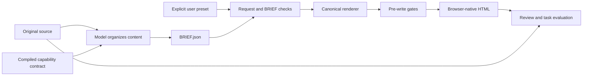

# slide-creator

> You have great content — but great content deserves a great presentation. AI can generate slides, but the results are inconsistent and re-rolling gets old fast. Slide-Creator separates content planning from consistent rendering: pick a style that fits your audience, then review important facts and decision conditions before presenting.
>
> **[See the guide as a report →](https://kaisersong.github.io/slide-creator/demos/blue-sky-en.html)** — this document was generated by slide-creator itself.

A skill for [Claude Code](https://claude.ai/claude-code) and [OpenClaw](https://openclaw.ai) that generates stunning, zero-dependency HTML presentations.

English | [简体中文](README.zh-CN.md)

---

## Download v2.32.0

[Compact Skill runtime ZIP](https://github.com/kaisersong/slide-creator/releases/download/v2.32.0/kai-slide-creator-v2.32.0-skill-runtime.zip) · [Release and SHA-256](https://github.com/kaisersong/slide-creator/releases/tag/v2.32.0) · [Optimization methodology v1.0.1 ZIP](https://github.com/kaisersong/slide-creator/releases/download/v2.31.0/skill-optimization-methodology-v1.0.1.zip)

Read the [cross-Skill optimization guide](docs/methodology/skill-optimization/README.md), including plan, evaluation and bug templates. The methodology is packaged separately to keep research documents out of the normal generation context.

---

## Live Demo

See what slide-creator produces — open directly in your browser:

- [slide-creator intro (English)](https://kaisersong.github.io/slide-creator/demos/blue-sky-en.html)
- [slide-creator 介绍（中文）](https://kaisersong.github.io/slide-creator/demos/blue-sky-zh.html)

Click any screenshot below to open the live demo (same content, different styles):

<table>
<tr>
<td colspan="3" align="center"><a href="https://kaisersong.github.io/slide-creator/demos/fantasy-rainbow-en.html"></a><br/><b>Fantasy Rainbow · 奇幻彩虹</b> — custom theme</td>
</tr>
<tr>
<td align="center"><a href="https://kaisersong.github.io/slide-creator/demos/blue-sky-en.html"></a><br/><b>Blue Sky</b></td>
<td align="center"><a href="https://kaisersong.github.io/slide-creator/demos/bold-signal-en.html"></a><br/><b>Bold Signal</b></td>
<td align="center"><a href="https://kaisersong.github.io/slide-creator/demos/electric-studio-en.html"></a><br/><b>Electric Studio</b></td>
</tr>
<tr>
<td align="center"><a href="https://kaisersong.github.io/slide-creator/demos/creative-voltage-en.html"></a><br/><b>Creative Voltage</b></td>
<td align="center"><a href="https://kaisersong.github.io/slide-creator/demos/dark-botanical-en.html"></a><br/><b>Dark Botanical</b></td>
<td align="center"><a href="https://kaisersong.github.io/slide-creator/demos/notebook-tabs-en.html"></a><br/><b>Notebook Tabs</b></td>
</tr>
<tr>
<td align="center"><a href="https://kaisersong.github.io/slide-creator/demos/pastel-geometry-en.html"></a><br/><b>Pastel Geometry</b></td>
<td align="center"><a href="https://kaisersong.github.io/slide-creator/demos/split-pastel-en.html"></a><br/><b>Split Pastel</b></td>
<td align="center"><a href="https://kaisersong.github.io/slide-creator/demos/vintage-editorial-en.html"></a><br/><b>Vintage Editorial</b></td>
</tr>
<tr>
<td align="center"><a href="https://kaisersong.github.io/slide-creator/demos/neon-cyber-en.html"></a><br/><b>Neon Cyber</b></td>
<td align="center"><a href="https://kaisersong.github.io/slide-creator/demos/terminal-green-en.html"></a><br/><b>Terminal Green</b></td>
<td align="center"><a href="https://kaisersong.github.io/slide-creator/demos/swiss-modern-en.html"></a><br/><b>Swiss Modern</b></td>
</tr>
<tr>
<td align="center"><a href="https://kaisersong.github.io/slide-creator/demos/paper-ink-en.html"></a><br/><b>Paper & Ink</b></td>
<td align="center"><a href="https://kaisersong.github.io/slide-creator/demos/aurora-mesh-en.html"></a><br/><b>Aurora Mesh</b></td>
<td align="center"><a href="https://kaisersong.github.io/slide-creator/demos/enterprise-dark-en.html"></a><br/><b>Enterprise Dark</b></td>
</tr>
<tr>
<td align="center"><a href="https://kaisersong.github.io/slide-creator/demos/glassmorphism-en.html"></a><br/><b>Glassmorphism</b></td>
<td align="center"><a href="https://kaisersong.github.io/slide-creator/demos/neo-brutalism-en.html"></a><br/><b>Neo-Brutalism</b></td>
<td align="center"><a href="https://kaisersong.github.io/slide-creator/demos/chinese-chan-en.html"></a><br/><b>Chinese Chan</b></td>
</tr>
<tr>
<td align="center"><a href="https://kaisersong.github.io/slide-creator/demos/data-story-en.html"></a><br/><b>Data Story</b></td>
<td align="center"><a href="https://kaisersong.github.io/slide-creator/demos/modern-newspaper-en.html"></a><br/><b>Modern Newspaper</b></td>
<td align="center"><a href="https://kaisersong.github.io/slide-creator/demos/neo-retro-dev-en.html"></a><br/><b>Neo-Retro Dev Deck</b></td>
</tr>
<tr>
<td align="center"><a href="https://kaisersong.github.io/slide-creator/demos/strategy-consulting-en.html"></a><br/><b>Strategy Consulting</b></td>
</tr>
</table>

---

## Design Philosophy: Models Plan Content, Programs Enforce Delivery

slide-creator serves the last step of a content workflow: turning an existing argument into a usable presentation. That step often arrives after a long conversation. The architecture preserves the original material and explicit choices, gives the model a compact content contract, and delegates repeated implementation to a renderer.


```mermaid
flowchart LR
    R["Explicit user preset"] --> V["Request and BRIEF checks"]
    S["Original source"] --> M["Model organizes content"]
    C["Compiled capability contract"] --> M
    M --> B["BRIEF.json"]
    B --> V
    V --> G["Canonical renderer"]
    G --> H["Pre-write gates"]
    H --> O["Browser-native HTML"]
    O --> Q["Review and task evaluation"]
    S --> Q
```

Review and evaluation run according to the requested workflow; ordinary generation does not automatically invoke an independent model judge. Each layer has a distinct responsibility.

### 1. Separate content judgment from repeated implementation

The model organizes claims, evidence, narrative, exhibit intent, local facts, the closing request and speaker notes. The program loads the complete selected style and runtime, chooses concrete layouts, implements CSS and JavaScript, assembles export DOM, and validates the output before writing.

This split reduces repeated source reads and implementation retries. A renderer defect belongs in the renderer; asking every new content task to inspect and patch runtime code would hide that defect and consume context. The generator follows `render_from_brief()` for native core presets, unified profile presets and supported custom themes.

Auto and Polish retain the same execution path. Auto produces a first draft; Polish adds deeper content and design review. Polish is an additional review workflow, not a guarantee of perfect source fidelity.

### 2. Treat BRIEF as a derived plan, not verified truth

Original material defines the facts. Explicit user choices define the requested output. `BRIEF.json` is the model's structured interpretation of both, so it can still contain a mistake. A valid schema does not make its claims true.

The plan keeps each page's claim, explanation, `supporting_facts`, numeric evidence and visual intent together. `numeric_facts` is an auxiliary index for binding values, not an extra set of table rows. `speaker_note` carries speaking guidance separately from audience-visible copy, and `desired_action` preserves the scope and timing of the closing request. Old BRIEF files retain documented fallbacks.

`--plan` creates this executable plan. `PLANNING.md` remains an optional human-readable view. The same rule applies to direct prompt generation: materialize BRIEF first and use the renderer instead of hand-authoring final HTML.

### 3. Compile a small model contract from complete implementation owners

`SKILL.md` routes the task. The generation contract comes from the existing schema, style compiler, title profiles and capability registry, so the model receives field shapes, supported layouts, tokens and content rules without repeatedly reading implementation source.

```text
Model reads   → generation-contract.md + main.py --model-context --preset <style>
Program reads → references/html-template.md + references/js-engine.md + one style file + base-css.md
Technical use → technical-language.md when the content requires it
Deeper design → relevant style/reference sections for a concrete missing decision
```

The complete capability stays in the program. Context reduction must preserve evidence, conditions and necessary design choices; an arbitrary reference-read limit is not a substitute for a useful contract.

### 4. Make explicit style choices independently enforceable

When the user has not selected a style, offer suitable previews and recommendations. When a style is already explicit, preserve it instead of reopening the choice.

Save that original selection in the task's `SLIDE_REQUEST.json` before authoring BRIEF. `--generate` checks the request independently of `BRIEF.style.preset`; a mismatch produces `PRESET MISMATCH` before output is written. The caller can also supply `--requested-preset` or `--request-file`. Aliases resolve against the actual style reference, and a conflicting argument cannot override the request file.

This requires the caller to record the user's choice correctly. It is a program constraint on the supplied request, not a guarantee that natural-language interpretation is infallible. Correct BRIEF after a mismatch; do not rewrite the request to fit the model's choice. Unsupported styles are reported rather than silently substituted.

### 5. Preserve meaning while fitting content to the page

Each page should carry complete local statements. Values stay attached to their source entities and units; targets remain targets, unknowns remain explicit, and interview clues do not become proven causes. A count of customers is not automatically a count of reviews, and an AND condition cannot become a single trigger.

Layout pressure calls for reflow, suitable exhibits and removal of complete verbatim duplicates. It does not justify clipping the last fact, inventing values, or repeating items to fill a fixed card count. Deduplication protects negation, decimal values, different conditions and the labels needed to interpret a metric. Unrelated units do not share a quantitative series; sparse material can explain the next test instead.

Titles need their own source review. A short headline can contradict a correct body by dropping a condition or changing the counted entity. Readability, contrast and visual rhythm are checked on the rendered result, with enough variety to support the argument rather than decoration alone.

### 6. Own the shared browser shell as well as the theme

A theme owns its visual language and content composition. The generator owns the shared editing, notes, navigation, progress and playback contract. A starter that omits required shell elements receives them; a theme that already provides them keeps one copy. Actual Edit/Done and keyboard interaction verifies that the shell works.

The delivered HTML runs in a browser without Python or a JavaScript build step, with local font fallback when network fonts are unavailable. The generator itself requires Python 3.10+ and its documented runtime dependencies. These are separate requirements.

Capability routing distinguishes the five native core presets, the four default recommendations, contextual Chinese Chan, reference-backed profile renderers and custom themes. Profile-rendered presets are renderable through the same program-owned path. A reference file or a bundled asset alone does not prove executable rendering or historical demo parity. The current Cloudhub limitation is documented rather than described as validated support.

### 7. Use complementary checks instead of one green score

| Layer | Responsibility | Meaning of a pass |
|---|---|---|
| Request and BRIEF | Check the explicit preset and input structure | The supplied request and plan are compatible |
| Pre-write gate | Check canonical provenance, required visible numbers and strict HTML/runtime rules | The output may be written under these program checks |
| Real browser | Activate actual controllers; measure geometry and contrast; exercise notes, editing and playback | The tested interaction and viewport work |
| Source review | Check entities, units, conjunctions, negation, targets, unknowns and headline strength | The reviewed content preserves its source |
| Full model task | Capture the task from request through generation, checks and independent grading | The evaluated task has a recorded outcome and cost |
| Release package | Extract the actual ZIP, install minimal dependencies and compare hosted bytes | The tested download corresponds to the release runtime |

Complete execution, automated pass, source-review pass and release publication are distinct states. A high mean quality score cannot cancel a critical semantic error. Known headline issues remain documented even when automated checks pass.

The ordinary CLI checks provenance, visible required numbers and strict HTML before writing. Requested single-deck `--eval` reports add diagnostics after that gate; they do not themselves prove a full model-task evaluation.

### 8. Measure efficiency together with quality and research cost

Optimization uses frozen inputs and implementation snapshots, fresh task workspaces, repeated model runs, real provider usage and independent grading. The same BRIEF rendered by two program versions isolates renderer behavior; it does not show what the model will author. Full prompt-to-deck runs answer the separate task-level question.

Report input, cached input, uncached input, output and wall time, keeping QA/grading and calibration costs visible. Failed and slow samples remain in the results. Cached input is included in total tokens, so a reduction in total tokens is not directly a reduction in billed cost.

Compare paired tasks and each task type, not just an overall average. Use inexpensive reproductions, focused regressions and fixed-input experiments before a complete validation round. Record research cost separately from per-deck savings; do not assemble a passing result from different versions' best samples.

### 9. Improve the Skill through versioned failure evidence

A discovered bug should identify the failed layer, preserve the original request and artifact, and become a regression input. Changes to contracts or generation behavior require appropriate task evaluation; checker defects require calibration of affected comparisons. Package-only and documentation checks must retain their narrower scope.

The [Skill optimization methodology](docs/methodology/skill-optimization/README.md) provides reusable plan, evaluation and bug templates with an update log. The [efficiency evaluation guide](evals/token-efficiency/README.md) documents the actual measurement protocol. This feedback loop improves the program and contracts without making every user task redo the research.

---

## Evaluation and Maintenance

These commands are for a full repository checkout with evaluation dependencies and, for model runs, an authenticated runner. The compact runtime ZIP intentionally excludes test and evaluation inputs.

The current before/after protocol is documented in [evals/token-efficiency/README.md](evals/token-efficiency/README.md): freeze the task set and runtime, run baseline and candidate arms, then compare measured cost, quality and failures. Source-review dispositions remain alongside automated results.

The older captured-run harness remains available:

```sh
python3 scripts/run-skill-evals.py --runner codex --run-live --format json --json-out .tmp-run/skill-evals/results.json
```

From a source checkout, validate the harness with a recorded fixture:

```bash
python3 scripts/run-skill-evals.py --runner fixture --case-id explicit-generate --normalized-trace tests/fixtures/skill-evals/explicit-generate-normalized.json --format json
```

The captured-run scores cover Outcome, Process, Style and Efficiency. Fixture scores validate the harness and do not constitute new model-task evidence.

Its Supervisor, Generate Worker and Style Judge labels describe evaluation roles, not mandatory agents in ordinary deck generation. Fixture runs verify the harness; they are not model-task evidence. See the [captured-run architecture](docs/design/2026-05-17-slide-creator-captured-run-eval-architecture.md) for that separate protocol.

For the public preset delivery matrix:

```sh
python3 scripts/preset_release_gate.py \
  --suite evals/preset-surface-all/manifest.json \
  --output-dir .tmp-run/release-gate \
  --contract --browser-geometry --mobile-geometry --export-smoke
```

This checks deterministic rendering, contracts, actual geometry and export DOM. `--pptx-export` is a separate real-export check; `--demo-parity` and `--promotion-gate` address their separate style claims. Report which options actually ran. On a single HTML deck, `scripts/browser_geometry_qa.py deck.html --mode both --laptop-window --strict` checks both window and presentation surfaces.

---

## Install

### Claude Code

Tell Claude: "Install https://github.com/kaisersong/slide-creator"

Or manually:
```bash
git clone https://github.com/kaisersong/slide-creator ~/.claude/skills/slide-creator
```

Restart Claude Code. Use as `/slide-creator`.

### OpenClaw

```bash
# Via ClawHub (recommended)
clawhub install kai-slide-creator

# Or manually
git clone https://github.com/kaisersong/slide-creator ~/.openclaw/skills/slide-creator
```

> ClawHub page: https://clawhub.ai/skills/kai-slide-creator

---

## Usage

### Commands

```
/slide-creator --plan       # Analyze content + resources/, create BRIEF.json
/slide-creator --generate   # Generate HTML from BRIEF.json
/slide-creator --review     # Diagnose and fix content quality issues
/slide-creator              # Start from scratch (interactive style discovery)
/kai-html-export            # Export to PPTX or PNG (separate skill)
```

### Bare Sandbox Fallback

`/slide-creator ...` is a Claude/OpenClaw slash-skill call, not a raw bash or python command.

If you are in a bare sandbox or external agent runner:

```bash
python3 main.py --validate-brief --brief BRIEF.json
python3 main.py --generate --brief BRIEF.json --output presentation.html
python3 main.py --generate --brief BRIEF.json --output presentation.html --eval
```

Built-in presets still load from `references/` / `references/style-index.md`; `themes/<name>/reference.md` is only for custom themes.
The raw CLI renderer covers native deterministic built-ins, unified profile built-ins, and custom themes through the same BRIEF-to-HTML path, then the same strict validator before final output.

### Planning Depths

- **Auto** — fast draft; skips Phase 3.5 Review
- **Polish** — deeper path; auto-runs Phase 3.5 Review

Same content switching between Auto/Polish should keep the same preset unless user explicitly requests a style change.

### Typical Workflows

**Interactive creation:**
1. Run `/slide-creator`, answer four questions (purpose, length, content, images)
2. See 3 style previews, pick one
3. Generate full deck, open in browser

**IR-first workflow (complex content):**
1. Put assets in `resources/` folder
2. Run `/slide-creator --plan "My AI startup pitch deck"`
3. Inspect `BRIEF.json`; only ask for `PLANNING.md` if a human review view is needed
4. Run `/slide-creator --generate`

**PPT conversion:**
1. Put `.pptx` file in current directory
2. Run `/slide-creator` — skill auto-detects and extracts content

### Review Mode

```
/slide-creator --review presentation.html
```

**Behavior:**
1. Load `references/review-checklist.md`
2. Execute 16 checkpoints (6 auto-detect + 10 AI-advised)
3. Show results: ✅ passed / 🔧 auto-fixable / ⚠️ needs confirmation / ❌ needs judgment
4. User chooses: [Auto-fix all] / [Confirm each] / [Skip]
5. Output fixed HTML + diagnostic report

**Polish mode:** Phase 3.5 Review runs automatically after generation.
**Auto mode:** Skips Phase 3.5.

### Timing

Expected end-to-end:

- **Auto:** ~3–6 minutes
- **Polish:** ~8–15 minutes

Tracked segments: `plan`, `generate`, `validate`, `polish`, `total`

---

## Features

### Core

- **IR-first workflow** — `--plan` distills `BRIEF.json`, `--generate` renders from the IR
- **Two planning depths** — Auto for speed, Polish for narrative and visual locking
- **Content Review System** — 16 checkpoints: `--review` for on-demand diagnosis; Polish auto-runs review; three rule types (hard/context-aware/advisory)
- **22 design presets** — each with named layout variations
- **Content-type routing** — auto-suggests best style for pitch decks, dev tools, data reports
- **Style discovery** — generate 3 visual previews before committing
- **Inline SVG diagrams** — flowcharts, timelines, bar charts, comparison grids, org charts — no external libs
- **Blue Sky starter template** — complete boilerplate so models never mis-implement the visual system

### Interaction

- **Play Mode** — Press `F5` or click the standard 44px round ▶ control (bottom-right) for fullscreen; circular page navigation, a top progress bar, and `NN / total` page labels stay consistent across shared-shell themes; `Esc` exits
- **Presenter Mode** — Press `P` for synced speaker window: notes, timer, slide counter, prev/next nav; height auto-adapts
- **Notes editing panel** — In edit mode (`E`), notes bar at bottom; click title bar to collapse/expand; edits sync live
- **Inline editing** — Default-on browser editing; hover the standard top-left Edit hotzone or press `E`, edit text and speaker notes in-browser, then press `Ctrl+S` to save
- **Viewport fitting** — Every slide fits 100vh exactly, no scrolling

### Output

- **Custom theme system** — Drop `reference.md` in `themes/your-theme/` to add a preset; `starter.html` is optional for complex systems, with the bundled `Fantasy Rainbow` theme serving as a generator-ready example
- **Template export chrome switch** — Set `data-export-progress="false"` on `<body>` to hide progress bar and nav dots
- **Image pipeline** — Auto-evaluate and process assets (Pillow)
- **PPT import** — Convert `.pptx` to web presentations
- **PPTX / PNG export** — via [kai-html-export](https://github.com/kaisersong/kai-html-export)
- **Bilingual** — Chinese / English support

---

## Design Presets

| Preset | Vibe | Best For |
|--------|------|----------|
| **Bold Signal** | Confident, high-impact | Pitch decks, keynotes |
| **Electric Studio** | Clean, professional | Agency presentations |
| **Creative Voltage** | Energetic, retro-modern | Creative pitches |
| **Dark Botanical** | Elegant, sophisticated | Premium brands |
| **Blue Sky** | Airy, enterprise SaaS | Product launches, tech decks |
| **Notebook Tabs** | Editorial, organized | Reports, reviews |
| **Pastel Geometry** | Friendly, approachable | Product overviews |
| **Split Pastel** | Playful, modern | Creative agencies |
| **Vintage Editorial** | Witty, personality-driven | Personal brands |
| **Neon Cyber** | Futuristic, techy | Tech startups |
| **Terminal Green** | Developer-focused | Dev tools, APIs |
| **Swiss Modern** | Minimal, precise | Corporate, data |
| **Paper & Ink** | Literary, thoughtful | Storytelling |
| **Aurora Mesh** | Vibrant, premium SaaS | Product launches, VC pitch |
| **Enterprise Dark** | Authoritative, data-driven | B2B, investor decks, strategy |
| **Glassmorphism** | Light, translucent, modern | Consumer tech, brand launches |
| **Neo-Brutalism** | Bold, uncompromising | Indie dev, creative manifesto |
| **Chinese Chan** | Still, contemplative | Design philosophy, brand, culture |
| **Data Story** | Clear, precise, persuasive | Business review, KPI, analytics |
| **Modern Newspaper** | Punchy, authoritative, editorial | Business reports, thought leadership |
| **Neo-Retro Dev Deck** | Opinionated, technical, handmade | Dev tool launches, API docs, hackathons |
| **Strategy Consulting** | Structured, authoritative, clean | Consulting reports, strategy decks, due diligence |

### Blue Sky

Light sky-blue gradient (`#f0f9ff → #e0f2fe`) with floating glassmorphism cards and animated ambient orbs. Inspired by a real enterprise AI pitch deck (CloudHub V12 MVP). Feels like a high-altitude clear day: open, confident, premium.

Signature elements: grainy noise texture overlay · 3 animated blur orbs repositioning per slide · glassmorphism cards with `backdrop-filter: blur(24px)` · 40px tech grid with radial mask · spring-physics horizontal transitions · cloud hero effect on title slides.

**Why Blue Sky is the starter template:** It demonstrates all 10 signature visual elements pre-built. Models only fill in content — no risk of mis-implementing the design system. This pattern (`reference.md` + `starter.html`) is reusable for any complex theme.

### Bundled Custom Theme: Fantasy Rainbow

`themes/fantasy-rainbow/` is a generator-ready custom theme selected with `style.preset: "custom:fantasy-rainbow"`. It reserves animated WebGL iridescence for the cover, uses opaque white editorial content pages with restrained blue/purple/cyan semantic accents, and closes on an opaque near-black surface. The theme stays on the standard non-Blue-Sky shared shell: 44px round Play control, circular page navigation, top progress, direct-child page labels, default-on Edit mode, speaker notes, presenter mode, reduced-motion fallback, print-safe output, and no remote runtime dependencies. Cover and closing emphasis comes from the optional `narrative.slides[].title_emphasis` field; older briefs use a generic title-structure fallback, never preset-specific copy matching. The legacy `custom:iridescence-convergence` preset remains a compatibility alias.

---

## Creating Custom Themes

1. Create `themes/your-theme/` directory
2. Write `reference.md` describing:
   - Colors (primary, accent, neutrals)
   - Typography (fonts, weights, sizes)
   - Layout patterns (cards, grids, full-bleed)
   - Component classes (if custom CSS needed)
3. Optionally add `starter.html` for complex visual systems (animated backgrounds, custom JS)

Your theme appears as "Custom: your-theme" in the style picker.

**Bundled custom themes:** `themes/fantasy-rainbow/` (generator-ready), `themes/shader-hero/` (Aurora Cover), `themes/molten-flow/`, `themes/stellar-vortex/`, `themes/ascii-stream/`, and `themes/kingdee/`

### Animated covers

All four animate only the first slide; content and closing pages stay static. A single HTML plays offline by double-clicking, with no server or extra files. Aurora Cover automatically chooses WebGL2 for local files/HTTP and prefers WebGPU on supported HTTPS origins; the other covers use WebGL. Reduced motion, unavailable graphics and PPTX/PNG export retain a detailed static cover.

| Name | Cover effect | Preview |
|---|---|---|
| Aurora Cover | Green/cyan curtains and flowing light filaments | [View](https://kaisersong.github.io/slide-creator/demos/shader-hero-zh.html) |
| Fantasy Rainbow | Bright, flowing iridescent bands | [See showcase](#live-demo) |
| Molten Flow | A twisting 3D gold ribbon with moving reflections | [View](https://kaisersong.github.io/slide-creator/demos/molten-flow-zh.html) |
| Stellar Vortex | Cyan/violet star core with spiral particles; outer motion is six times slower than the core | [View](https://kaisersong.github.io/slide-creator/demos/stellar-vortex-zh.html) |

Say **“which animated covers are available? Show me previews”**, **“use Molten Flow for this product launch”**, or **“use Stellar Vortex for this technology presentation.”** A request for an animated opening without another preference defaults to Aurora Cover. See [the cover catalog](references/animated-covers.md) for preset IDs and prompt examples.

| Molten Flow | Stellar Vortex |
|---|---|
| [](https://kaisersong.github.io/slide-creator/demos/molten-flow-zh.html) | [](https://kaisersong.github.io/slide-creator/demos/stellar-vortex-zh.html) |

---

## Brand Style Migration

Migrate existing `.pptx` to custom brand design — get pixel-perfect archive + editable version.

```bash
# Step 1 — re-style
/slide-creator --plan "migrate company-deck.pptx to our brand style"
/slide-creator --generate  # → branded-deck.html

# Step 2 — export both modes
/kai-html-export branded-deck.html              # pixel-perfect
/kai-html-export --pptx --mode native branded-deck.html  # editable
```

---

## Requirements

The generator requires **Python 3.10+** and **beautifulsoup4**. Generated HTML opens directly in a browser without Python or a JavaScript build step; fonts fall back locally when network fonts are unavailable.

```sh
python3 -m venv .venv
.venv/bin/python -m pip install -r scripts/requirements-runtime.txt
.venv/bin/python main.py --model-context --preset "Data Story"
```

Run these commands inside the extracted `kai-slide-creator/` folder and use that environment’s Python for subsequent CLI commands. On Windows, use `.venv\Scripts\python.exe`. Browser QA and PPTX export require additional tooling beyond the ordinary generation path.

For PPTX/PNG export: `clawhub install kai-html-export` or `pip install playwright python-pptx`

---

## Output

- `presentation.html` — single-file, zero dependencies, runs in browser
- `PRESENTATION_SCRIPT.md` — speaker notes (auto-generated if ≥8 slides)

---

## Compatibility

| Platform | Version | Install path |
|---------|---------|-------------|
| Claude Code | any | `~/.claude/skills/slide-creator/` |
| OpenClaw | ≥ 0.9 | `~/.openclaw/skills/slide-creator/` |

---

## Runtime-only Skill ZIP

Download [`kai-slide-creator-v2.32.0-skill-runtime.zip`](https://github.com/kaisersong/slide-creator/releases/download/v2.32.0/kai-slide-creator-v2.32.0-skill-runtime.zip) for a compact Skill installation bundle. Extract its top-level `kai-slide-creator/` folder into your agent's skills directory. The archive contains only `SKILL.md`, `main.py`, `scripts/`, `schemas/`, `references/`, and `themes/`; repository README files, demos, tests, eval fixtures, design documents, and Git metadata are excluded.

---

Cloudhub enterprise assets are retained from the previous package, but its legacy reference lacks executable layouts and canonical generation remains blocked by the visual-variety gate; it is not claimed as a validated renderer. Kingdee generation is verified after repairing the shared editor shell.

---

## Version History

**v2.32.0** — Animated cover themes and offline playback: adds Aurora Cover, Molten Flow and Stellar Vortex alongside Fantasy Rainbow, with a four-cover catalog and friendly prompt routing. New cover effects animate only the first slide, support offline single-HTML and HTTP/IP playback through WebGL2, pause on content pages and suspended states, and retain detailed static posters for graphics failure, reduced motion, print and export. Stellar Vortex keeps its 24-second core orbit, with 72-second middle and 144-second outer orbits, shorter and dimmer peripheral trails. Includes shared lifecycle controls, canonical BRIEF rendering, static export, demos and an updated runtime ZIP.

**v2.31.0** — Context and quality optimization: models author BRIEF while the program loads complete styles and runtime. Adds independent user-preset constraints, complete source facts and numeric entity binding, readable body text and exact-copy deduplication. The frozen optimization implementation passed all 26 automated runs on eight fixed task types, including correct styles in all 24 positive decks. Against the original baseline, median generation tokens fell 77.57%, median generation time fell 36.59%, and mean quality rose from 77.88 to 88.54. Headlines can still change counted entities or omit conjunctive conditions; important decks need source review. These results are bounded to the evaluated tasks and local CLI, rather than a guarantee across all tasks or installations. Includes a separately downloadable Skill optimization methodology v1.0.1 with templates. Release checks additionally repair narrow-screen layouts and custom-theme notes-panel visibility.

**v2.30.2** — Fantasy Rainbow playback performance fix: stop cover WebGL and CSS decorations when navigating away or suspending playback, resume a single animation loop on return, and remove per-frame slide geometry scans. Disable full-slide transform transitions while retaining the fixed presentation scale; use short opacity reveals and a complete blackout overlay. Includes 36 lifecycle regression tests and a synchronized runtime-only installation ZIP.

**v2.30.1** — Fantasy Rainbow long-running animation and presentation chrome fixes: keep GPU time within its original animation cycle to prevent floating-point banding and blocks; hide the global browsing counter during presentation and restore it on exit. Templates, generated shells, and bilingual Fantasy Rainbow demos are synchronized. The runtime-only ZIP is available for enterprise installation.

**v2.30.0** — Playback and short-window geometry release: play mode is now a measured surface instead of an assumption. `scripts/browser_geometry_qa.py` gains `--mode window|present|both`, a `--laptop-window` viewport (`1440x733`), and a new `browser-geometry-content-clipped` hard failure that catches body copy, list rows, table cells and footers cropped by the slide box — previously only titles were checked, and only in window mode at 900px-tall viewports. The release-gate desktop geometry step now runs all three window shapes in both modes. Two new strict validators encode the runtime bugs behind that gap: `playback_scale_safety` rejects a root font size driven by window width (play mode pins slides to a fixed `1440x900` box, so width-driven typography truncates dense slides on the projector while looking correct in the window), and `canvas_visibility_guard` rejects canvas buffers sized from `getBoundingClientRect()` without a small-rect guard (a hidden slide reports `0x0`, collapsing an animated cover to a 1x1 buffer stretched into a flat gradient). Generators gained the missing short-window rhythm: the native-core shells, Swiss Modern evidence stacks, the unified profile renderer, the Blue Sky starter and the Fantasy Rainbow theme all compact at `max-height: 860px` instead of clipping at a real laptop window height, display numerals keep a line box tall enough for their glyphs, and long phone showcase lists fall back to two compact columns rather than losing rows. Blue Sky and Vintage Editorial production demos are fixed accordingly, and `references/base-css.md` plus `references/impeccable-anti-patterns.md` document the play-mode geometry contract, the hidden-element measurement rule, and window-mode-only verification as anti-patterns.

**v2.29.3** — Fantasy Rainbow content fidelity release: the iridescence renderer no longer emits slide-creator's own product copy. The hero, fracture, brief, contract, gates, runtime, modes, and closing scenes now render the caller's `BRIEF.json` instead of hardcoded demo strings, and a shared label/description splitter feeds the two-part scene components. The spectrum display total is derived from the item count rather than a fixed `22`, explicit `supporting_facts` take precedence over facts derived from `claim` and `explanation` so truncated duplicate fragments no longer appear, and `brief` fields emit three grid cells so body text stops wrapping inside the narrow label column. Decks longer than the twelve-scene list now cycle the middle scenes instead of repeating `use-cases`, which previously tripped the visual variety gate and made decks over eleven pages ungeneratable; scene mapping for the first ten content pages is unchanged.

**v2.29.2** — Semantic title emphasis release: Fantasy Rainbow now reads the important cover or closing phrase from the structured `title_emphasis` field, removes all preset-specific title and phrase lookup tables, and falls back to generic punctuation, script, and visual-length rules for older briefs. Structural `|` / `｜` separators no longer leak into rendered headlines, and multiline cover titles receive cover-only glyph clearance. The release adds arbitrary business-copy regression coverage, updates the bilingual documentation, refreshes production demo watermarks, and ships a new runtime-only Skill ZIP.

**v2.29.1** — Fantasy Rainbow runtime package release: renamed the bundled custom theme from Iridescence Convergence to Fantasy Rainbow, moved its canonical preset to `custom:fantasy-rainbow`, retained `custom:iridescence-convergence` as a compatibility alias, refreshed the bilingual README and production demo watermarks, and added a runtime-only Skill ZIP release asset.

**v2.29.0** — Iridescence Convergence and shared-shell consistency release: added a generator-ready custom theme with cover-only WebGL iridescence, opaque white editorial content pages, restrained semantic accents, and a dark closing surface; restored its runtime chrome to the standard 44px round Play control, circular page navigation, top progress bar, direct-child page labels, and discoverable 80px Edit hotzone; gave no-starter custom themes the required viewport shell, marked Enterprise Dark insight-pull titles with the canonical export slot, expanded strict/browser regression coverage, and refreshed current production demo watermarks for v2.29.0.

**v2.28.0** — Generation quality gate release: tightened single-deck evals with hard failures for unauthorized placeholder/demo-copy residuals, corrected Paper & Ink signature scoring against the real reference demo, and improved CJK title wrapping so medium Blue Sky report titles use available horizontal space instead of splitting words like "风险" or "地图" across forced lines.

**v2.27.0** — Captured-run eval architecture release: added OpenAI-style skill eval prompts, normalized trace scoring, fixture style rubrics, live Codex baselines, regression comparison, and optional release-gate integration. README and design docs now document the Supervisor / Generate Worker / Style Judge split, context isolation rules, and token accounting policy so live eval cost remains visible instead of hidden by subagents.

**v2.26.0** — Blue Sky deterministic renderer and custom theme release: Blue Sky now renders through the canonical BRIEF pipeline with strict validation coverage, custom themes resolve correctly in both source and plugin layouts, and private Kingdee / Cloudhub theme assets were cleaned up, compressed, and locked with regression tests.

**v2.25.0** — Strategy Consulting preset: new consulting-style design with 12 canonical layouts (exec summary, before/after, three things, funnel, framework matrix, quote + evidence, driver breakdown, etc.), white-background navy-accent visual language inspired by MBB slide decks. Preset count now 22.

**v2.24.3** — Single-deck eval and production verification release: `--generate` / `render-from-brief` can now emit per-deck eval JSON via `--eval` or `--eval-out`, Data Story chart routing/label logic now fails closed on weak numeric signals instead of drawing fake charts, and production demo fixtures were revalidated and resynced to the current watermark version so core preset verification remains green.

**v2.24.2** — Enterprise Dark / Chinese Chan chrome hardening: validator now rejects hidden-brand regressions for presets that must suppress `#brand-mark`, and watermark checks now fail stale version/preset strings so non-canonical shell output cannot pass `--strict` with leaked skill names or outdated credits.

**v2.24.1** — Direct-route contract and pre-write gate fix: forced direct prompt generation back through `BRIEF.json -> render_from_brief()`, made both CLI render entrypoints run `scripts/validate_html.py --strict` before writing output, and tightened the SKILL/workflow/doc contracts plus regression tests so non-canonical Chinese Chan HTML can no longer slip through a current-version generation path.

**v2.24.0** — Core preset hardening and quality-gate release: added preset support tiers plus manifest-driven eval/release-gate tooling, upgraded low-context BRIEF semantics and preset usage rules, repaired Chinese Chan formal contracts and production/shared runtime drift, modernized family demo runtimes, moved the canonical HTML validator to `scripts/validate_html.py` with a compatibility wrapper, and tightened Swiss Modern/shared shell chrome so nav dots and page-number treatments render correctly across presets.

**v2.23.2** — Sandbox entrypoint and skill-surface patch: added root `main.py` plus `slide-creator` wrapper for bare-sandbox BRIEF validation/rendering, made `--plan` fail with a clear slash-skill boundary instead of a misleading runtime error, restored `SKILL.md`'s user-facing style recommendation surface, and clarified that built-in presets live under `references/` while `themes/<name>/reference.md` is only for custom themes.

**v2.23.1** — Enterprise Dark runtime stability patch: fixed shared js-engine active-slide reveal toggling, hid editing chrome by default, replaced unresolved watermark tokens with real version/preset metadata, stabilized one-gesture-per-page wheel pagination for scroll-snap decks, and corrected Enterprise Dark narrative cover routing, split-title clipping, governance/table rhythm, and subtle grid overlay balance.

**v2.23.0** — Title composition and low-context quality release: added a preset-aware title profile registry plus browser-level title QA, expanded low-context diagnostics/eval buckets for quality uplift checks, hardened strict gates around shared runtime and `body[data-preset]`, and reordered `SKILL.md` so style enforcement, narrative arc, and title quality take priority over degradable playback/edit/watermark features.

**v2.22.0** — Style reference rollout and strict quality gate hardening: all presets now pass style-reference audit, Swiss Modern plus Enterprise Dark / Data Story / Glassmorphism / Chinese Chan gain explicit canonical export contracts and user-content routing, `tests/validate.py --strict` is documented and tested as the `--generate` pre-write gate, and new regression coverage locks CSS variable resolution, layout variety, and priority preset contract checks.

**v2.19.0** — IR-first release: `BRIEF.json` becomes the primary truth source, `PLANNING.md` is optional human view, late-context eval fixtures added under `evals/generated-decks/`, README design philosophy rewritten around prompt → BRIEF → HTML → validate → eval, and stronger regression coverage added for the new contract.

**v2.18.1** — Paper & Ink style fix: restored correct editorial style reference (Cormorant Garamond headlines, Source Serif 4 body, crimson ornamental rules, drop caps); added `.slide-content` wrapper to slide HTML structure for proper vertical centering; Chinese text font fallback now uses system serif (宋体) instead of Noto Sans SC.

**v2.18.0** — JS engine extraction (html-template.md 557→222 lines); style signature injection expanded to require all CSS classes from Typography/Components sections; neon-cyber glow effects clarified; style consistency audit tool (`tests/audit_style_consistency.py`).

**v2.17.0** — Style reference system overhaul; contrast fix for light backgrounds; glassmorphism text theme mapping.

**v2.12.0**

**v2.11.0** — Hard rules embedded in SKILL.md; `--generate` flow restructured with explicit validation.

**v2.9.0** — Content Review System: 16 checkpoints (6 auto-detectable, 10 AI-advised); Phase 3.5 Review in Polish mode; `--review` command for on-demand diagnosis; three rule types (hard/context-aware/advisory).

**v2.8.0** — Simplified planning depths (Auto / Polish); bilingual naming; timing guidance; preset-lock across depths; checked-in demo paths; regression coverage.

**v2.7.1** — Zero-dependency `check-doc-sync.py` contract checker for SKILL.md/README/workflow.md sync; regression test integration.

**v2.7.0** — Enhancement Mode guardrails for editing existing HTML decks; inline editing default-on but optional; bundled brand theme examples (`themes/cloudhub/`, `themes/kingdee/`).

**v2.6.1** — Brand Style Migration workflow documentation.

**v2.6.0** — Design Quality Baseline (`references/design-quality.md`): minimum 65% fill, multi-column balance, 90/8/2 color law, no 3 consecutive bullet slides, content-tone color calibration, pre-output self-check. Fixed aurora-mesh Inter font contradiction (Space Grotesk + DM Sans).

**v2.5.0** — 21 presets with Blue Sky starter template; Show Don't Tell style discovery.

**v2.0.0** — Two-stage workflow (`--plan` / `--generate`); inline editing; presenter mode.

**v1.0.0** — Initial release with 10 presets.
